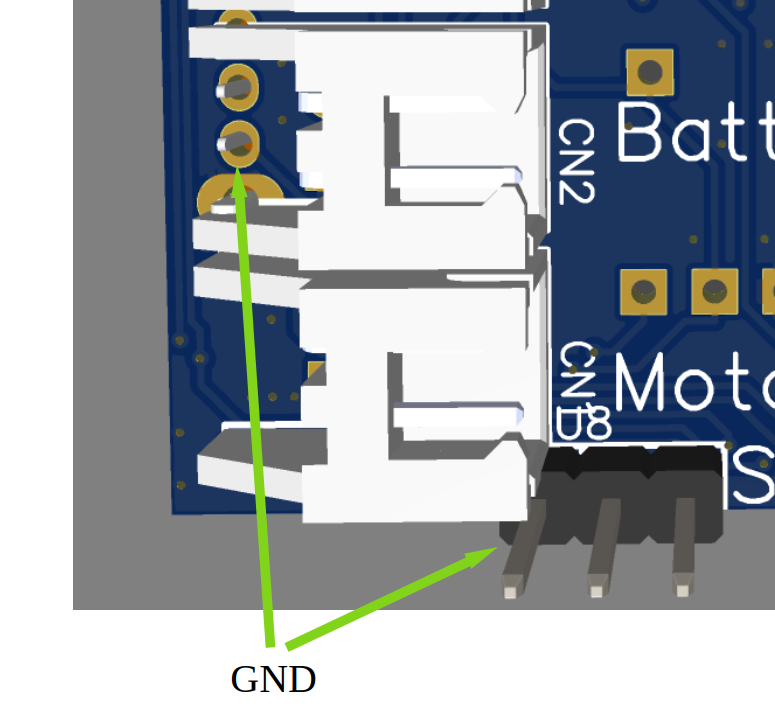
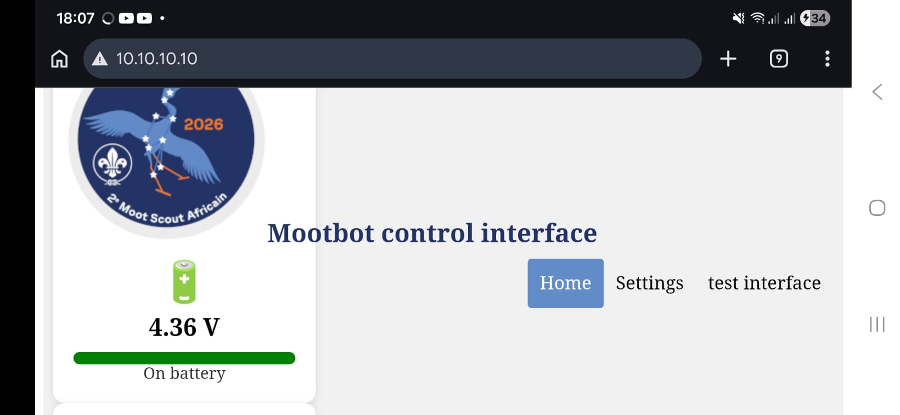
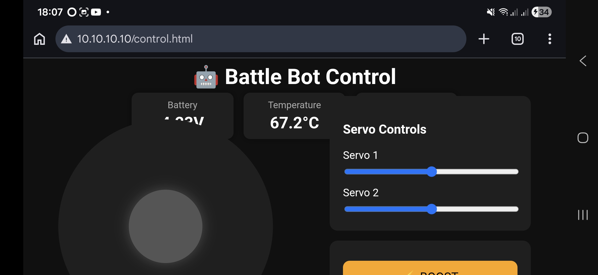
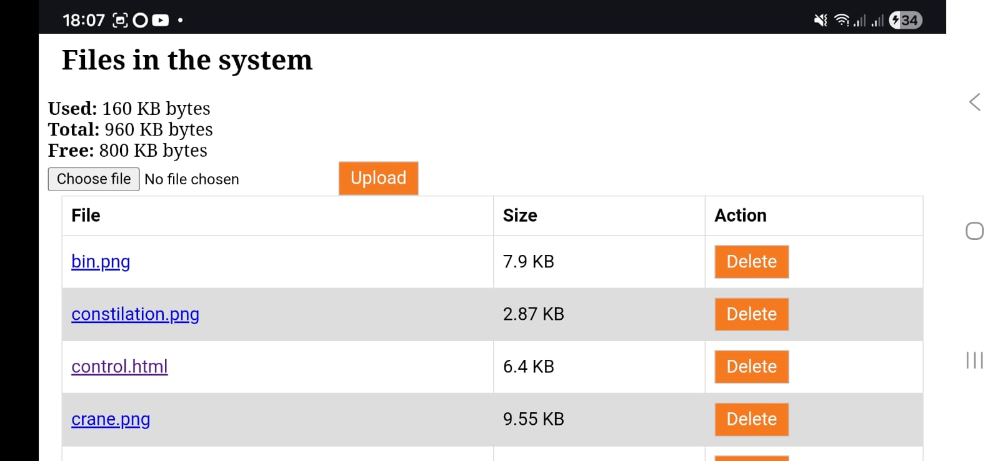
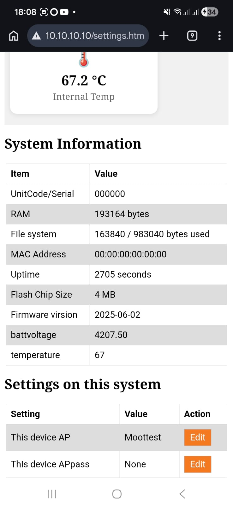

## Assembly Instructions 

This guide will help you assemble, configure, and use your Kijani Battle Bot controller. 

## PCB Front

## PCB Back

## Parts Required 

You should have the following parts: 

- Kijani controller PCB 

- 1S LiPo battery 

- 2 DC motors 

- 1 Servo 

- ⚠️� Check that all parts are present before starting assembly. 

## Connecting the Components 

## Step 1 – Turn the Controller Off 

Before connecting anything, make sure the power switch is in the **OFF** position. If your board does not have a on and off visable off is away from the servo connector

## Step 2 – Connect the Battery 

Connect the battery to the battery connector. 

⚠️� Battery polarity is important. 

The black (negative) wire must connect to the square pad. 

 

## Step 3 – Connect the Motors 

Connect the two motors to the motor outputs. 

Motor polarity is not critical. 

If the robot drives backwards, simply swap the motor wires or adjust the controls later. 

## Step 4 – Connect the Servo 

Connect the servo to one of the servo headers. 

⚠️� Servo polarity is important. 

The brown or black wire must connect to the square pad. 

## Charging the Battery 

The battery can be charged using the Micro USB connector. 

Recommended procedure: 

1. Turn the robot OFF. 

2. Connect a Micro USB cable. 

3. Allow the battery to charge fully before use. There is a charge light to indicate this 

## Connecting to the Robot 

## Step 1 

Switch the controller ON. 

You should hear a startup tune played through the motors. 

## Step 2 

Using your phone, tablet, or laptop, connect to the WiFi network: 

MootBot_xxxxxx 

where xxxxxx is a unique identifier. 

## Step 3 

Some devices may warn that the network does not have internet access. 

Select: 

Stay Connected 

or 

Use This Network Anyway 

depending on your device. 

## Step 4 

Open a web browser and navigate to: 

http://10.10.10.10 

You should now see the robot home page. 

## Controlling Your Robot 

From the home page: 

1. Locate controller.html 

2. Open it 

You should now see the control interface. 

The default controller allows you to: 

- Drive both motors 

- Control the servo 

- Test robot movement 

## Making Changes 

One of the main features of Kijani is that you can upload your own web pages. 

Examples: 

- Custom controllers 

- Alternative layouts 

- Mobile-friendly interfaces 

- Robot-specific controls 

Use the supplied controller.html as a starting point. 

Files can be uploaded directly from the home page. There is no protect for overwriting existing files. its best to backup files before overwiting. 

⚠️� Be careful when modifying system files. 

A factory reset does not restore deleted or modified web pages. 

## Settings 

Open the Settings page to configure the robot. 

Available settings include: 

- WiFi name (SSID) 

- WiFi password 

- Robot-specific configuration values 

- System information 

## Factory Reset 

If you forget the WiFi password: 

1. Turn the controller OFF. 

2. Short the PGM pins together. 

3. Turn the controller ON. 

4. Wait for the factory reset tune. 

The controller will: 

- Remove stored settings 

- Restore default configuration 

Factory Reset does NOT restore deleted files. 

If system files have been removed or damaged, you must re-upload the filesystem from a computer. 

## Firmware Updates 

The current firmware version is displayed on the home page. 

To update the firmware: 

1. .bin Download the latest firmware file from GitHub. 

2. Open the Firmware Update page. 

3. Upload the new firmware. 

4. Wait for the update to complete. 

5. The controller will restart automatically. 

- ⚠️� Ensure the battery is fully charged before performing a firmware update. 

Firmware releases can be found in: 

firmware/ 

within the project repository. 

## Troubleshooting 

## I cannot see the WiFi network 

- Check that the battery is connected. 

- Verify the controller is switched ON. 

- Listen for the startup tune. 

- Restart the controller. 

## The robot drives backwards 

Swap the motor wires or modify the control page. 

## The servo does not move 

Check: 

- Servo orientation 

- Battery charge level 

- Servo connection

## The unit restarts when movbing the servo or motors

Check that the battery is charged, make sure there are no shorts on the motor. 

## I forgot the WiFi password 

Perform a Factory Reset. 

## I deleted an important file 

Reconnect the controller to a PC and re-upload the filesystem image. 
