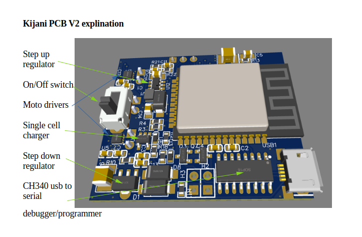
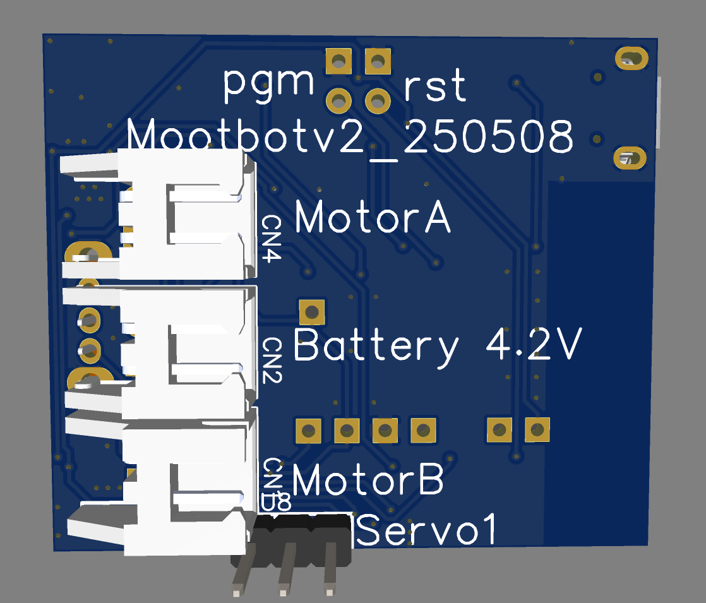

# Kijani Battle Bot Platform


An open-source ESP32-based battle robot platform designed for affordable combat robots, educational robotics, and custom remote-controlled projects.

Built for:
- Battle bots
- Educational robotics
- Rapid prototyping
- Custom web-controlled robots

---
# Order a bot?

Do you want a bot? If there are enough people in your area I will organise a big buy and ship to you. Please fill out the google form so we know what interest is in what areas. We will look at the results in august and contact everyone who filled in the form as well as possibly make an order form here. We estimate the full kit will be around R600 for a bot with assembled pcb, battery n20 motors and servo

https://docs.google.com/forms/d/e/1FAIpQLSefcmKqDehQRFsC9WDCJS6LWhJCRrktLrYrf-59QBeeA0L29w/viewform?usp=publish-editor

When Ive done with V3 of the board I will also make a link available on easyeda so you can order dirctly from them if you wish. you will however I think you will need to buy a minimum of 5 from there.

---

# 📸 Project Photos

## PCB Front


## PCB Back


---

# ✨ Features

- ESP32-based controller
- Dual DC motor outputs
- Two servo outputs
- Built-in LiPo charging
- WiFi access point
- Browser-based control
- Custom HTML/JavaScript interfaces
- LittleFS web hosting
- USB programming/debugging
- Open HTTP API
- File upload and management system
- Fully customizable control interface

---

# 🎯 Project Goals

The Kijani project was created to make combat robotics:

- Cheaper
- Easier to build
- Easier to customise
- More accessible to beginners

Instead of needing many separate modules, Kijani combines:

- Motor drivers
- Charging circuitry
- Control electronics
- WiFi hosting
- Filesystem hosting

onto a single compact PCB.

---

# 🛠 Hardware Overview

The PCB includes:

| Component | Function |
|---|---|
| ESP32 | Main processor |
| CH340 | USB programming |
| Dual motor drivers | Drive control |
| Servo outputs | Servo control |
| Boost regulator | Optional higher voltage |
| LiPo charger | Single-cell charging |
| LittleFS | Web interface storage |

---

# 🤖 Typical Robot Configurations

- Flipper bot
- Spinner bot
- Differential drive robot
- Steering servo robot
- Educational robot
- Experimental robotics platform

---

# 🔋 Supported Batteries

## Recommended
- 1S LiPo (3.7V nominal)
- 18650 type battery
- 2x AA batteries, just dont try charge them

---

# ⚙ Recommended Motors

## Drive Motors
Recommended:
- N20 gear motors
- Micro metal gear motors
- TT motors (lightweight robots only)

## Recommended Voltage
- 3V–6V

## Recommended Current
- Under 1A continuous per motor

---

# ⚠ Important Warnings

## Servo Voltage Warning

The boost regulator can output voltages higher than some servos can tolerate.

Always verify:
- Servo voltage rating
- Regulator configuration
- Battery voltage

before enabling boost mode.

Incorrect voltage can permanently damage servos.

---

## LiPo Safety

LiPo batteries can be dangerous if:
- Punctured
- Short-circuited
- Overcharged
- Physically damaged

Always:
- Supervise charging
- Inspect batteries regularly
- Use correct polarity
- Remove damaged batteries immediately

---

# 💻 Software Architecture

The project consists of two main parts.

---

## ESP32 Firmware

Written using:
- C++
- Arduino Framework
- PlatformIO

Handles:
- Motor control
- WiFi
- API
- Settings storage
- Telemetry
- Filesystem management

---

## Web Interface

Stored directly on the ESP32 using LittleFS.

Written using:
- HTML
- CSS
- JavaScript

Allows:
- Custom control pages
- Telemetry dashboards
- Robot configuration
- Mobile phone control

---

# 🌐 API Features

The built-in HTTP API supports:

- Motor control
- Servo control
- Live telemetry
- Settings management
- Filesystem browsing
- File uploads
- File deletion

This allows users to create fully custom control systems.

---

# 🚀 Quick Start

## 1. Clone Repository

```bash
git clone https://github.com/zaplakkies/kijani.git
```

---

## 2. Open in VSCode

Install:
- VSCode
- PlatformIO extension
- plug in the board
- Program

## 3. Open Web Interface

Connect to the Mootbot wifi acces point. Open browser and navigate to:

```text
http://10.10.10.10
```

---

# 📁 Repository Structure

```text
/src      ESP32 source code
/data          Web interface files
/hardware      PCB files and schematics
/documentation Documentation
/images        Photos and screenshots
```

---

# 🔧 Development Tools

| Tool | Purpose |
|---|---|
| VSCode | Development |
| PlatformIO | Firmware upload |
| EasyEDA | PCB editing |

---

# 🧪 Factory Reset

If the password is forgotten:

1. Power off the board
2. Short the PGM pins
3. Power on the board
4. Listen for the factory reset tune

The board will:
- Erase stored settings
- Restore defaults

---

# 📡 Example API Request

Drive both motors forward:

```http
/processcontrol?M1=255&M2=255
```

Move servo:

```http
/processcontrol?S1=90
```

Read telemetry:

```http
/quickstatus
```

see the api docs for more information
---

# 🛣 Roadmap

Planned future features:
- WebSocket low-latency control
- Competition management tools
- Multi-weapon support

---

# 🤝 Contributing

Contributions are welcome.

Ideas:
- Bug fixes
- UI improvements
- Documentation
- Robot designs
- API improvements
- Hardware improvements


---

# 🙏 Credits

Original Author:
Marc d'Hotman de Villiers

Inspired by:
- Combat robotics
- Rover Moot project
- Open-source robotics communities

---

# 🔗 Links

## PCB Files
[PLACEHOLDER_EASYEDA_LINK]

## Rover moot
https://www.scouts.org.za/2africascoutmoot/

## Videos
[PLACEHOLDER_YOUTUBE]

---

# ⭐ Support The Project

If you build something using Kijani:
- Share photos
- Share videos
- Submit improvements
- Open pull requests
- Help improve documentation

---